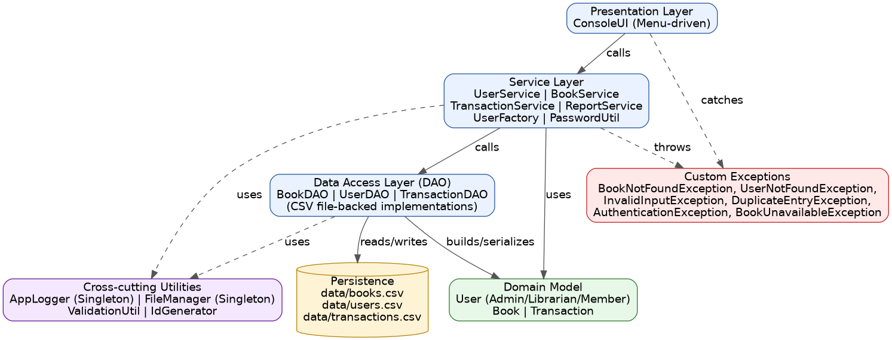
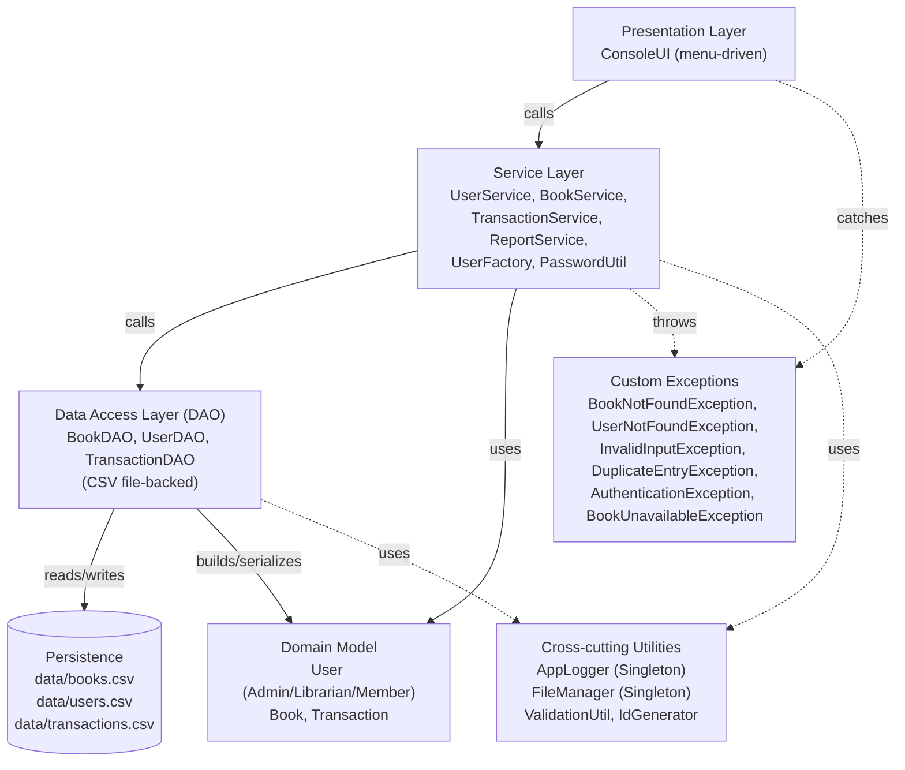

# System Architecture Diagram

Layered architecture: the console UI never talks to storage directly — every
request flows down through the service layer (business rules) and the DAO
layer (persistence), and every failure flows back up as a typed exception.

