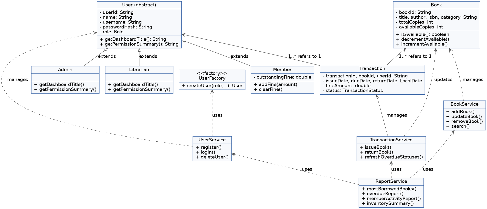
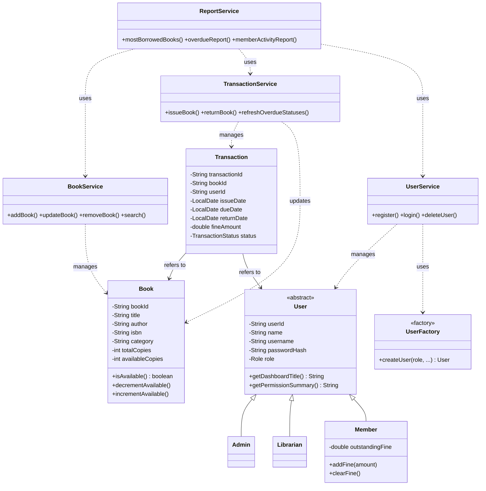

# Class / Component Diagram

Highlights the OOP design: an abstract `User` with three concrete role
subclasses, the domain entities `Book` and `Transaction`, the service layer
that orchestrates them, and the `UserFactory` (Factory pattern) used to
instantiate the correct `User` subtype.

