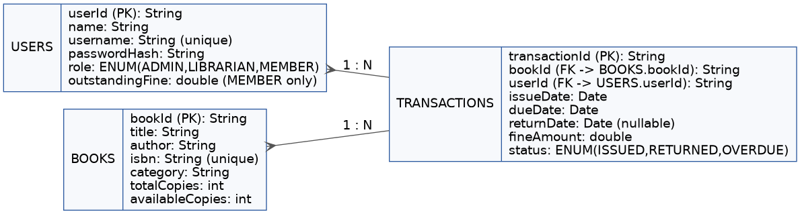
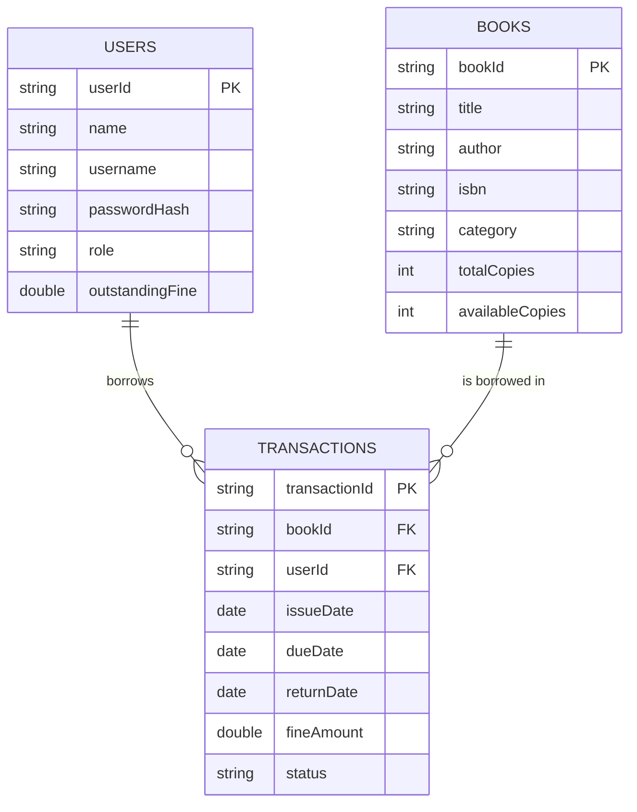

# ER / Storage Design Diagram

The system persists three CSV-backed "tables". `TRANSACTIONS` is the
associative entity linking `USERS` and `BOOKS` (many issue/return records
per user, and per book).

