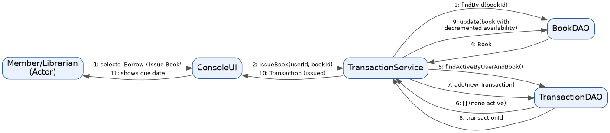
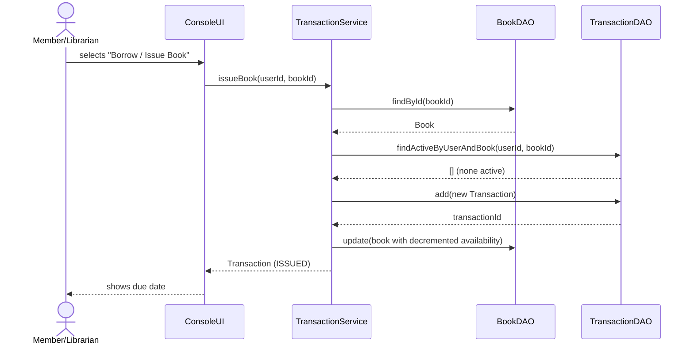

# Sequence Diagram — Issue Book

Shows the message flow when a Librarian (or Member, self-service) issues a
book: the `TransactionService` checks availability, records the transaction,
and updates the book's available copy count.

