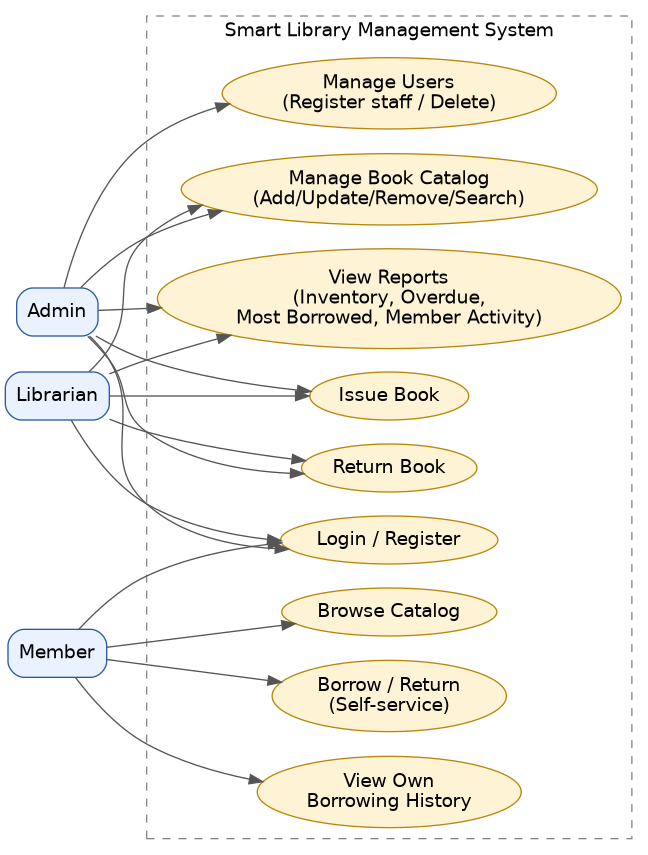
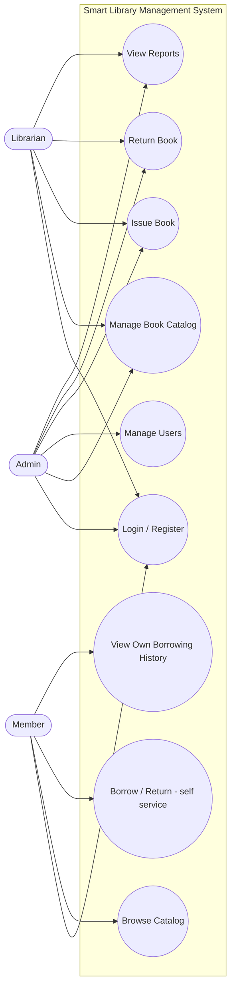

# Use Case Diagram

Three actors share the system, each restricted to the use cases relevant to
their role (role-based access control enforced in `ConsoleUI`).

```mermaid
graph LR
    Admin([Admin])
    Librarian([Librarian])
    Member([Member])

    subgraph SLMS["Smart Library Management System"]
        UC1((Login / Register))
        UC2((Manage Book Catalog))
        UC3((Manage Users))
        UC4((Issue Book))
        UC5((Return Book))
        UC6((View Reports))
        UC7((Browse Catalog))
        UC8((Borrow / Return - self service))
        UC9((View Own Borrowing History))
    end

    Admin --> UC1
    Admin --> UC2
    Admin --> UC3
    Admin --> UC4
    Admin --> UC5
    Admin --> UC6
    Librarian --> UC1
    Librarian --> UC2
    Librarian --> UC4
    Librarian --> UC5
    Librarian --> UC6
    Member --> UC1
    Member --> UC7
    Member --> UC8
    Member --> UC9
```
