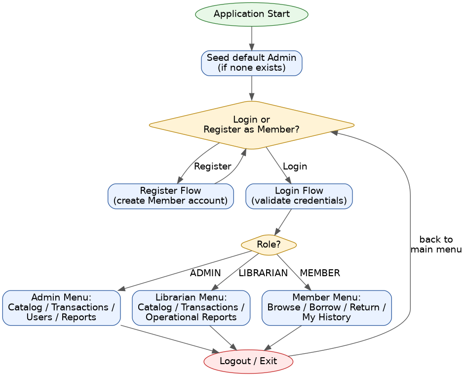
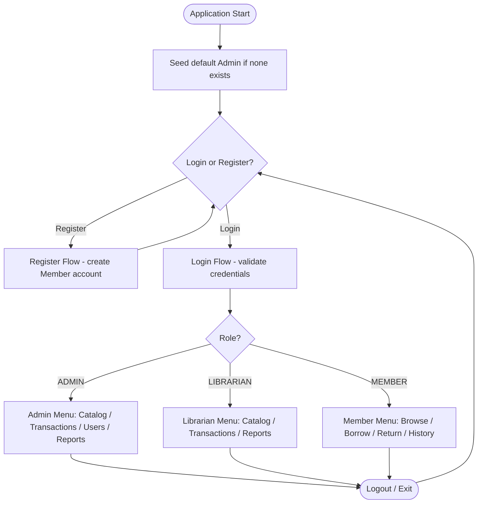

# Process Flow / Workflow Diagram

End-to-end flow from application start through role-based menus back to
logout.

```mermaid
flowchart TD
    Start([Application Start]) --> Seed[Seed default Admin if none exists]
    Seed --> MainMenu{Login or Register?}
    MainMenu -->|Register| Register[Register Flow - create Member account]
    MainMenu -->|Login| Login[Login Flow - validate credentials]
    Register --> MainMenu
    Login --> RoleCheck{Role?}
    RoleCheck -->|ADMIN| AdminMenu[Admin Menu: Catalog / Transactions / Users / Reports]
    RoleCheck -->|LIBRARIAN| LibMenu[Librarian Menu: Catalog / Transactions / Reports]
    RoleCheck -->|MEMBER| MemMenu[Member Menu: Browse / Borrow / Return / History]
    AdminMenu --> End([Logout / Exit])
    LibMenu --> End
    MemMenu --> End
    End --> MainMenu
```
